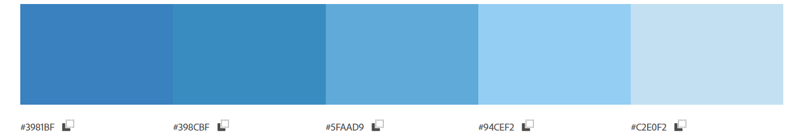
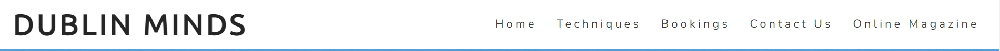
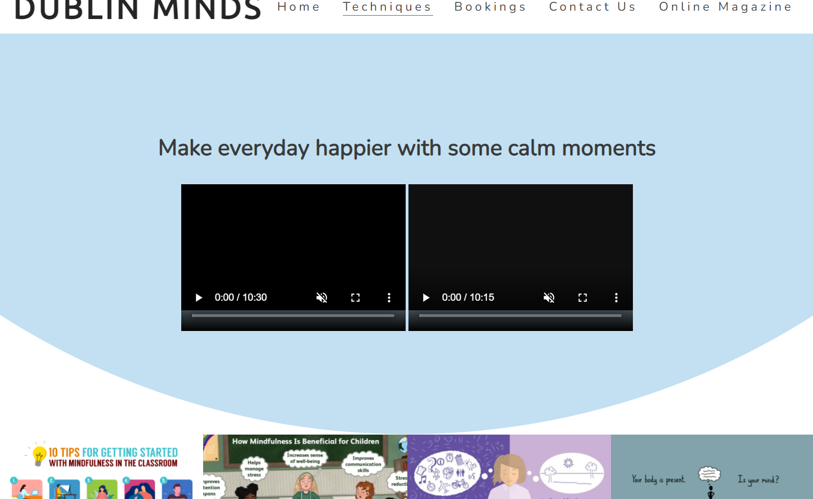
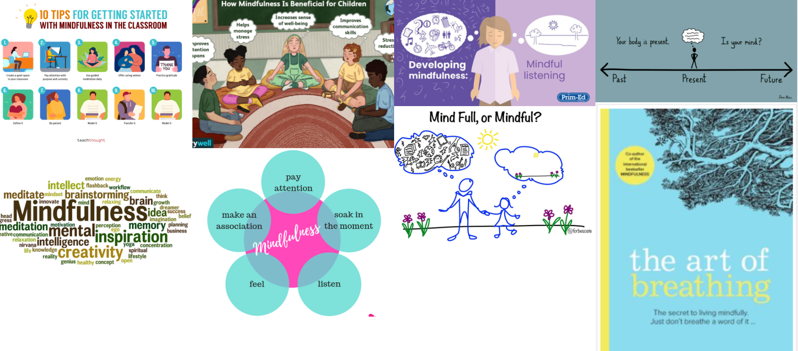
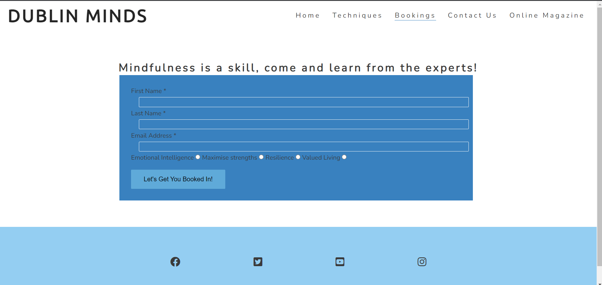
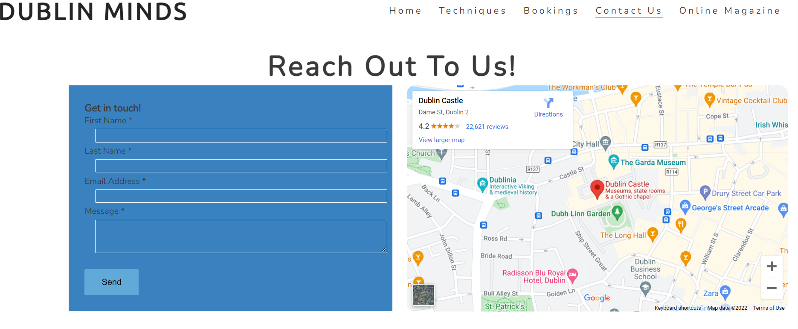
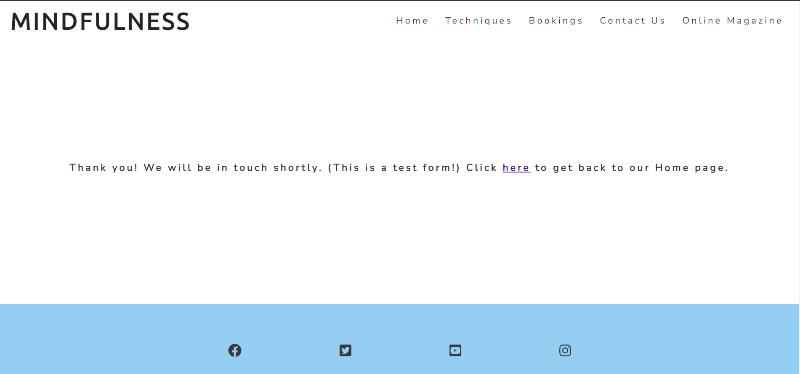
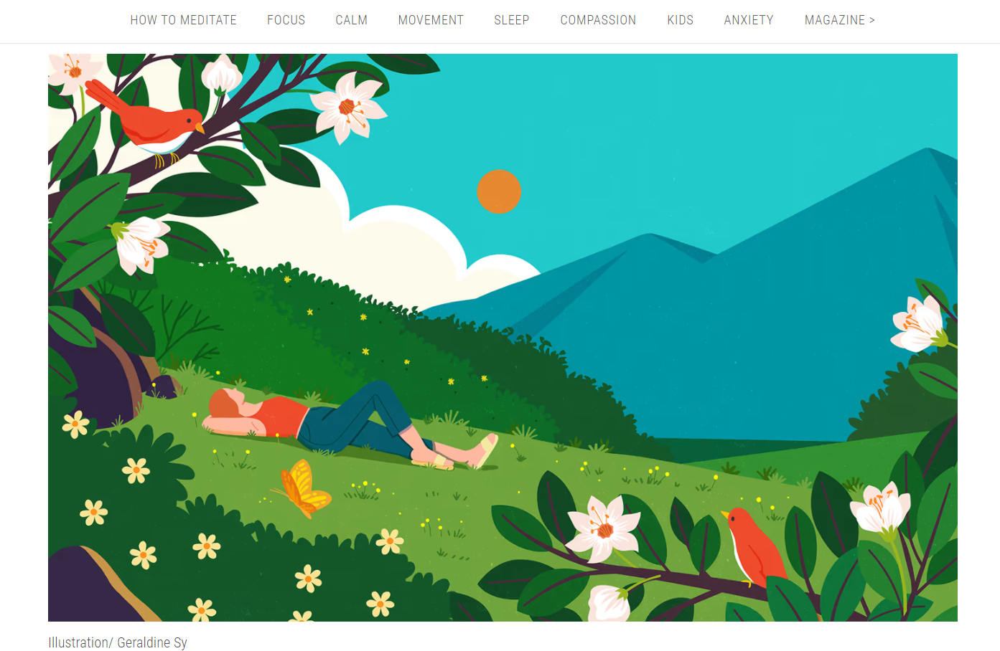
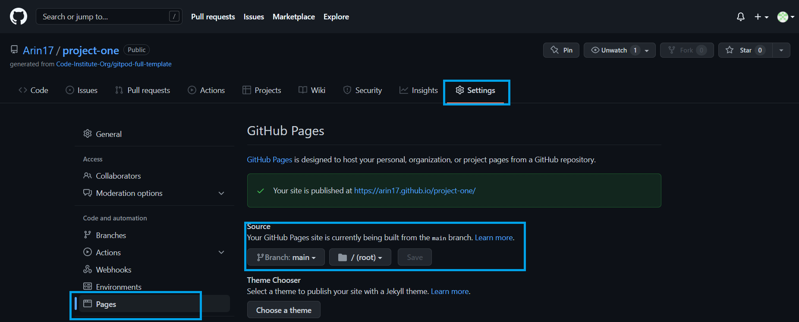

# **_Dublin Minds_**

Dublin Minds is an upcoming company set up to assists individuals to get over stressful conditions and live a balanced life.

Visit <a href="https://arin17.github.io/project-one/index.html" target="_blank" rel="noopener">Dublin Minds</a>

# Contents

- [User Experience (UX)](#user-experience--ux-)
  * [Site Structure](#site-structure)
  * [Design Choices](#design-choices)
    + [Typography](#typography)
    + [Colour Scheme](#colour-scheme)
- [Features](#features)
  * [Existing Features](#existing-features)
    + [Navigation Menu](#navigation-menu)
    + [Footer](#footer)
    + [Techniques](#techniques)
    + [Gallery](#gallery)
    + [Bookings](#bookings)
    + [Contact Us](#contact-us)
    + [Form Confirmation](#form-confirmation)
    + [Online Magazine](#online-magazine)
  * [Future Features](#future-features)
- [Technologies Used](#technologies-used)
- [Testing](#testing)
- [Deployment](#deployment)
- [Credits](#credits)
    + [Content](#content)
    + [Media](#media)
- [Acknowledgements](#acknowledgements)

# User Experience (UX)

## Site Structure

Dublin Minds' website has four pages. The [home page](index.html) is the default loading page, [techniques](tech.html), [bookings](book.html) and [contact us](contact.html) pages are all accessible primarily from the navigation menu. There is another link to the bookings page in the 'book a session' section to some navigational flexibility to the site visitor. 

[Back to top](<#contents>)

## Design Choices

* ### Typography
      The fonts selected are 'Ubuntu' for the headings and 'Nunito' for the body text. Each fall back to sans-serif. 
     *  'Ubuntu' was chosen for the headings due to it's subtle boldness and to give the user an calming welcoming feel.
      * 'Nunito' is used for the body text as it provides a nice calming and inviting feel whilst being easy to read for all.

 * ### Colour Scheme
      The chosen colour scheme is based on blue. The colour palette applied globally to the website was derived from the colour of the hero image. The colour Blue is calmimg and goes well with the overall theme of the website, given that Dublin Minds promotes mindfulness and wellbeing as an experience it hopes it's users and site visitors will avail of.

[Back to top](<#contents>)

# Features

Dublin Minds website is designed to be welcoming, intuitive and user friendly. It contains features that the user would probably be familiar with, such as a navigation bar and contact form. The aesthetics of the website is intended to be calming, inviting and not intimidating to encourage the user to explore the site further. 

## Existing Features  
  * ### Navigation Menu

    * Situated at the top of all the pages in the website, it is fully responsive and contains links to all the pages of the website.  It is designed to enable ease of navigation in a convenient location.
    * The logo is clickable with a link back to the home page for enhanced UX.

[Back to top](<#contents>)

* ### Footer
    
    * Contains social media links. To enhance the UX the links open in other tabs.
    * The social media presence will encourage site visitors to connect with Dublin Minds.
    

[Back to top](<#contents>)

* ### Techniques

    * The techniques page provides the site visitor with a couple of videos that can assists the user to practice mindfulness and wellbeing techniques on their own and at their leisure.
    * There are images which also provide visual clues on what mindfulness is.
    * This section would be updated as and when new techniques are introduced to the field to reflect an ever growing development in the field.

[Back to top](<#contents>)

* ### Gallery

      * Located on the techniques page beneath the video section.
      * A responsively styled grid of images using 'masonry' styling of photos of mindfulness techniques. 

[Back to top](<#contents>)

* ### Bookings
    * This page is provides the site visitor with a form for booking a session with Dublin Minds.

[Back to top](<#contents>)

* ### Contact Us

    * This section completes the online navigational journey for the site user. It has a map showing the address and a form provided for the site user to make contact with Dublin Minds.
    * There is a form that the user can choose to fill in. It has 4 input fields, name, email, address, and a textarea.

[Back to top](<#contents>)

* ### Form Confirmation
    * Both the submit buttons on the bookings page, labelled 'Let's Get You Booked In' and on the contact-us page, labelled 'Send', open the response.html page. Form validation on the forms are solely intended to prevent the user from entering incorrect information.
    * A direct link back to the contact page is prodvided as well as the normal navigation menu links in the header and footer.

[Back to top](<#contents>)

* ### Online Magazine
    * This is simply a link that opens a magazine cover page in a new tab.

[Back to top](<#contents>)

## Future Features 

* A 'subscription' section where site users can subscribe to Dublin Minds magazine publication and also have access to past issued and archived magazines.

[Back to top](<#contents>)

# Technologies Used
* [HTML5](https://html.spec.whatwg.org/) - provides the content and structure for the website.
* [CSS](https://www.w3.org/Style/CSS/Overview.en.html) - provides the styling.
* [Balsamiq](https://balsamiq.com/wireframes/) - used to create the wireframes.
* [Gitpod](https://www.gitpod.io/#get-started) - used to deploy the website.
* [Github](https://github.com/) - used to host and edit the website.

[Back to top](<#contents>)

# Testing

Please refer to [**_here_**](TESTING.md) for more information on testing Dublin Minds.

[Back to top](<#contents>)

# Deployment

### **To deploy the project**
The site was deployed to GitHub pages. The steps to deploy a site in Github Pages are as follows:
  1. In the GitHub repository, navigate to the **Settings** tab.
  2. Once in Settings, navigate to the **Pages** tab on the left hand side.
  3. Under **Source**, select the branch to **master**, then click **save**.
  4. Once the master branch has been selected, the page will be automatically refreshed with a detailed ribbon display to indicate the successful deployment.

The live link to the Github repository can be found here - https://arin17.github.io/project-one/

[Back to top](<#contents>)

# Credits

### Content
- Textual content for Mindfulness sourced from 
- Textual content for Foundations of minfulness was sourced from https://www.habitsforwellbeing.com/the-four-foundations-of-mindfulness/
- Textual content for booking session headings sourced from positivepsychology.com
- The font was sourced from Google Fonts.
- Balsamiq was used to create the wireframes.
- Curved video section tutorial from https://www.youtube.com/watch?v=mqzSY6Qy0yk

[Back to top](<#contents>)

### Media
- The hero image photo was sourced from coreevolution.de.
- Sunlight through plant leaves photo was sourced from britannica.com on Pinterest.
- Mindfulness-image-by-Doug-Neill sourced from Elsevier.com
- Developing mindfulness photo sourced from https://www.prim-ed.ie/blog/post/developing-mindfulness--mindful-listening/
- The-Art-of-Breathing photo sourced from http://franticworld.com/free-meditations-from-mindfulness/
- Benefits-of-mindfulness-for-kids photo sourced from https://www.verywellfamily.com/benefits-of-mindfulness-for-kids-4769017
- Tips-For-Teaching-Mindfulness-In-School photo sourced from https://www.teachthought.com/pedagogy/teaching-mindfulness-any-grade/
- Mind-Full-or-Mindful photo sourced from https://management30.com/blog/a-guide-to-mindfulness-at-work/
- MindfulnessWordCloud photo sourced from https://www.corehealing.co.uk/mindfulness-2/
- Cropped-Mindful photo sourced from https://www.foxfields-cit.co.uk/social-and-emotional-learning/mindfulness/
- Photos were cropped using MS Paint.
- Icons were sourced from Font Awesome.
- Daily Calm video sourced from https://www.youtube.com/watch?v=ZToicYcHIOU
- Train your brain video sourced from https://www.youtube.com/watch?v=TLKxdTmk-zc
- Videos were converted using https://onlinevideoconverter.pro/en11/youtube-video-downloader

[Back to top](<#contents>)

# Acknowledgements
The website was completed as a Portfolio 1 Project piece for the Full Stack Software Developer (e-Commerce) Diploma at the [Code Institute](https://codeinstitute.net/). It has been an educational experience, I would, therefore, like to thank my family, my mentor [Precious Ijege](https://www.linkedin.com/in/precious-ijege-908a00168/), the Slack community, and all at the Code Institute for their help, support and patience throughout this journey. Dublin Minds is a fictional company, although being mindful and living in the moment is an exploratory pastime for the author.

Arinola Soetan 2022.

[Back to top](<#contents>)